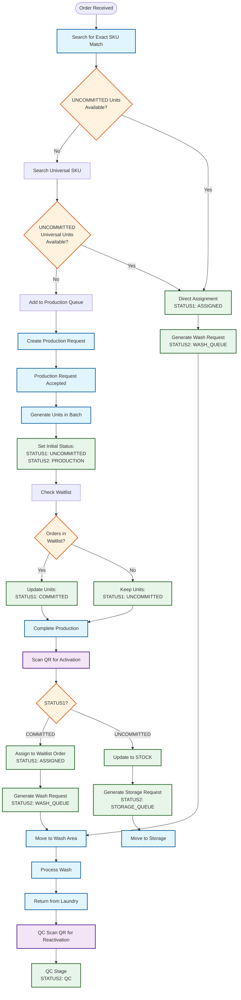

# End-to-End Process Flow: Order to QC

## Process Overview Flowchart



## Key Process Stages

### 1. Order Receipt & SKU Search
- Order received with target SKU
- System searches for exact SKU match
- Falls back to universal SKU if no exact match
- Direct assignment if UNCOMMITTED units available

### 2. Production Request Flow
- Created when no matching units found
- Specifies quantity and universal SKU
- Accepted by production team
- Generates batch of units

### 3. Unit Status Management
- Initial status setting
- Waitlist processing
- Status updates based on availability
- Tracking through production stages

### 4. Post-Production Activation
- QR code scanning
- Status bifurcation:
  * COMMITTED → ASSIGNED + Wash
  * UNCOMMITTED → STOCK + Storage

### 5. Wash Processing
- Wash request generation
- Movement to wash area
- External laundry processing
- Return for QC

### 6. Quality Control
- QC department scans QR for reactivation
- STATUS2 updates to QC
- Measurement verification
- Quality inspection
- Defect checking
- Next stage determination

## Status Transitions Summary

### STATUS1 Transitions
```
UNCOMMITTED ──┬──> COMMITTED ──> ASSIGNED
              └──> STOCK
```

### STATUS2 Transitions
```
PRODUCTION ──┬──> WASH_QUEUE ──> WASHING ──> LAUNDRY ──> QC
            └──> STORAGE_QUEUE ──> STORAGE
```

## Key Decision Points

1. **SKU Match Check**
   - Exact match available?
   - Universal match available?
   - Production needed?

2. **Waitlist Processing**
   - Orders in waitlist?
   - Priority order?
   - Quantity match?

3. **Post-Activation Flow**
   - COMMITTED or UNCOMMITTED?
   - Wash type needed?
   - Storage location?

4. **Quality Control**
   - QR code reactivation required
   - Measurements within spec?
   - Quality acceptable?
   - Next stage determination? 