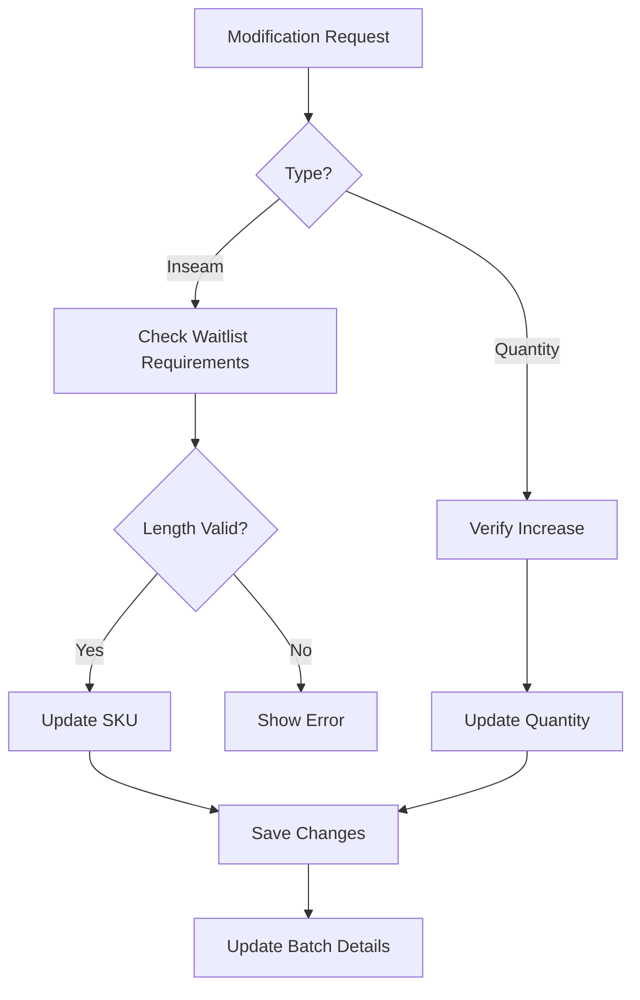

# Production Request Modification Rules

## Overview
This document outlines the rules and functionality for modifying production requests, specifically focusing on quantity adjustments and inseam length modifications while maintaining waitlist compatibility.

## Modification Options

### 1. Quantity Adjustment
- Can increase quantity at any time
- Additional units follow same SKU rules
- New units get added to existing batch
- Maintains original priority and timeline

### 2. Inseam Length Modification
- Can modify inseam length with restrictions
- Must respect waitlist requirements
- System enforces minimum length based on waitlist
- Original SKU components remain unchanged

## Validation Rules

### Inseam Restrictions
1. **Minimum Length Check**
   ```typescript
   // Example logic
   const minAllowedLength = Math.max(
     ...waitlistOrders.map(order => order.targetSku.length)
   );
   
   // Validation
   if (newInseam < minAllowedLength) {
     throw new Error(
       `Inseam cannot be shorter than ${minAllowedLength} due to waitlist requirements`
     );
   }
   ```

### Example Scenarios

#### Scenario 1: Valid Modification
```
Original Request:
- SKU: ST-32-X-36-RAW
- Quantity: 10
- Waitlist: 8 orders (max length needed: 32)

Valid Modifications:
✓ Change inseam to 32
✓ Change inseam to 34
✓ Increase quantity to 15
```

#### Scenario 2: Invalid Modification
```
Original Request:
- SKU: ST-32-X-36-RAW
- Quantity: 10
- Waitlist: 8 orders (max length needed: 32)

Invalid Modifications:
✗ Change inseam to 31 (below waitlist requirement)
✗ Change inseam to 30 (below waitlist requirement)
```

## Modification Process

### 1. Initial Checks
- Load current production request details
- Fetch all associated waitlist orders
- Calculate minimum allowed inseam
- Validate current status allows modification

### 2. Validation Steps
1. **For Inseam Changes**:
   - Check against waitlist requirements
   - Verify new length ≥ maximum waitlist length
   - Ensure SKU validity with new length

2. **For Quantity Changes**:
   - Verify increase only
   - Check production capacity
   - Update resource requirements

### 3. Update Process


## UI Components

### 1. Modification Form
```typescript
interface ModificationForm {
  newQuantity?: number;
  newInseam?: number;
  reason?: string;
  priority?: 'HIGH' | 'MEDIUM' | 'LOW';
}
```

### 2. Validation Messages
- Clear error messages for invalid modifications
- Warning for significant changes
- Confirmation for valid modifications

### Example UI Flow
```
1. User clicks "Modify" on production request
2. System loads current details and waitlist
3. Form shows:
   - Current quantity (can only increase)
   - Current inseam (with min value set)
   - Reason field
   - Priority adjustment
4. Real-time validation as user types
5. Submit only enabled if valid
```

## System Updates

### 1. Database Updates
- Production request record
- Batch information
- SKU details
- Quantity tracking

### 2. Notifications
- Production team alert
- Waitlist order updates
- System logs
- Audit trail

## Success Criteria

### For Inseam Changes
- New length ≥ maximum waitlist requirement
- SKU remains valid
- All waitlist orders still fulfillable
- Production timeline maintained

### For Quantity Changes
- Only increases allowed
- Resources available for additional units
- Timeline feasible
- Capacity available

## Error Handling

### Common Scenarios
1. **Invalid Inseam**
   ```typescript
   if (newInseam < minAllowedLength) {
     return {
       error: true,
       message: `Cannot modify inseam to ${newInseam}. 
                Minimum allowed length is ${minAllowedLength} 
                due to waitlist requirements.`
     };
   }
   ```

2. **Invalid Quantity**
   ```typescript
   if (newQuantity <= currentQuantity) {
     return {
       error: true,
       message: 'New quantity must be greater than current quantity.'
     };
   }
   ```

## Implementation Notes

### Key Considerations
1. **Performance**
   - Efficient waitlist querying
   - Quick validation checks
   - Responsive UI updates

2. **Data Integrity**
   - Atomic updates
   - Consistent state
   - Audit logging

3. **User Experience**
   - Clear feedback
   - Real-time validation
   - Intuitive interface

### Best Practices
- Validate early and often
- Provide clear error messages
- Maintain audit trail
- Ensure data consistency 